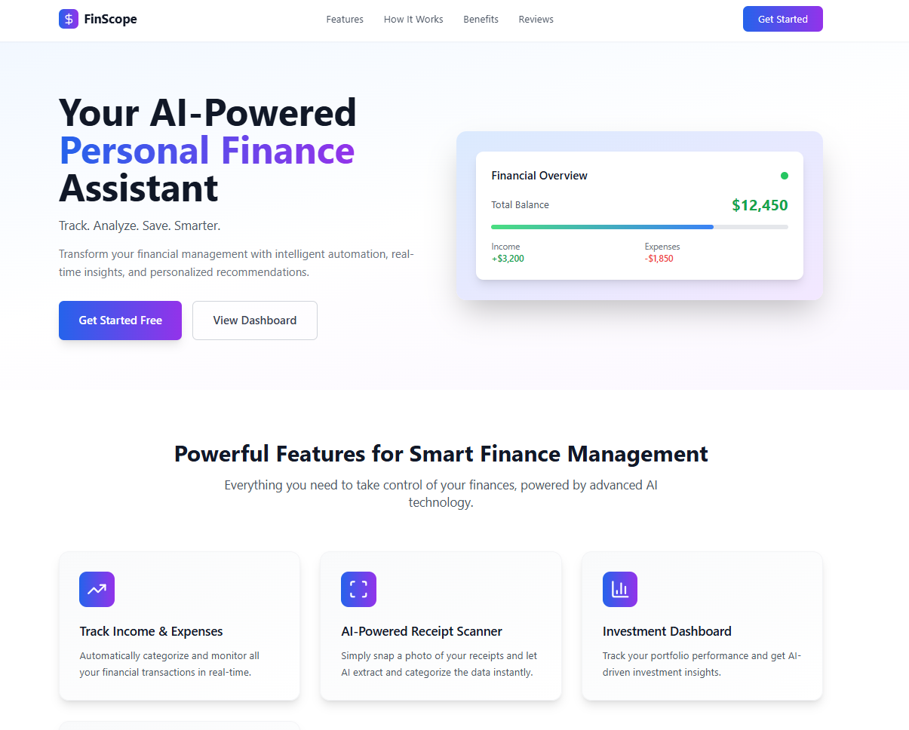
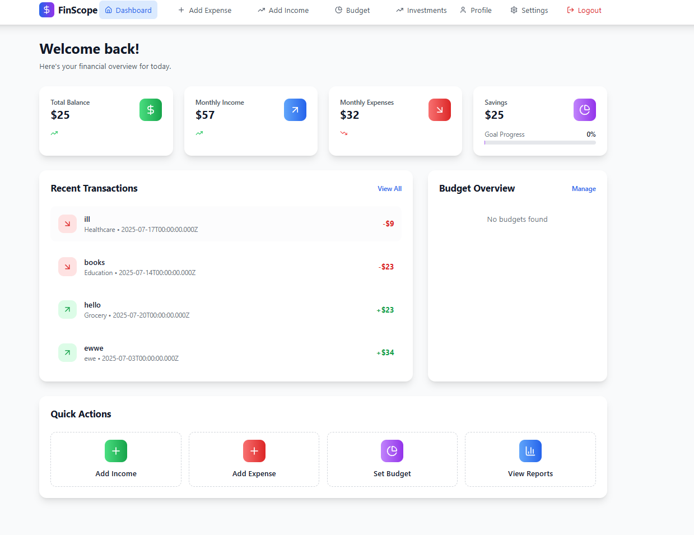
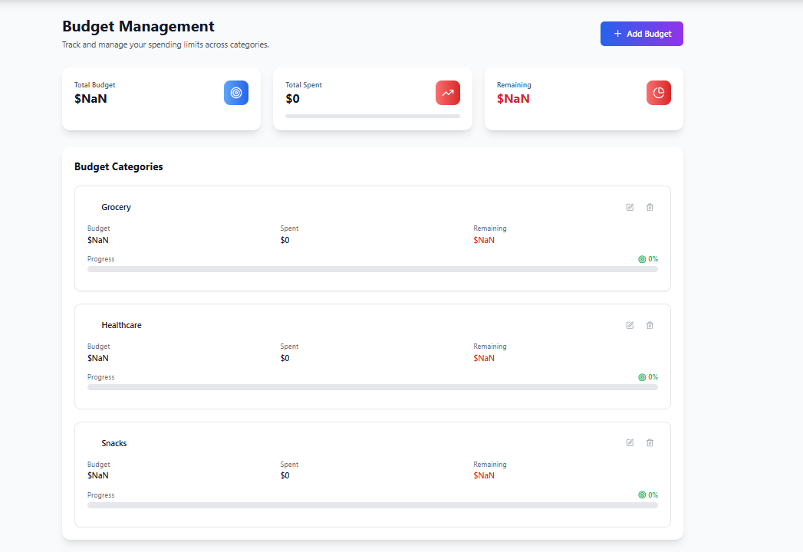

# 💸 FinScope – AI-Powered Personal Finance Assistant

FinScope is an intelligent personal finance management web application that empowers users to take control of their money. It leverages automation and AI-driven features such as receipt scanning, smart dashboards, and real-time alerts to make budgeting and expense tracking smarter and simpler.

---

## 📸 Landing Page



---

## 🚀 Features

### 🧠 Smart Dashboard
Get a real-time snapshot of your:
- ✅ Total Balance
- ✅ Monthly Income and Expenses
- ✅ Savings & Goal Progress
- ✅ Recent Transactions



---

### 📊 Budget Management
Track and manage spending across multiple budget categories:
- Set budget limits by category (e.g., Healthcare, Snacks)
- View remaining budget and spent amounts
- Visual progress bars and budget indicators



---

### 💼 Income & Expense Management
- Add and view detailed income and expense records
- Separate pages for **Income** and **Expense**
- Categorical and date-wise tracking

---

### 🤖 AI Receipt Scanner
- Snap a photo of your receipt
- Extract and auto-fill transaction data
- Save time and eliminate manual entry

---

### ✉️ Real-Time Budget Alerts
- Get notified via email when you're close to or exceed your budget
- Smart reminders to keep your finances in check

---

## 🛠️ Tech Stack

- **Frontend:** React.js, Tailwind CSS
- **Backend:** Node.js, Express.js, MongoDB
- **Authentication:** JWT-based Auth
- **Email Alerts:** Nodemailer
- **AI Integration:** OCR for receipt scanning

---

## 📁 Project Structure


---

## ✅ Getting Started

### 1. Clone the repository
```bash
git clone https://github.com/your-username/finscope.git
cd finscope
### 1. Setup backend
cd backend
npm install
npm start
### 1. Setup frontend
cd frontend
npm install
npm run dev
