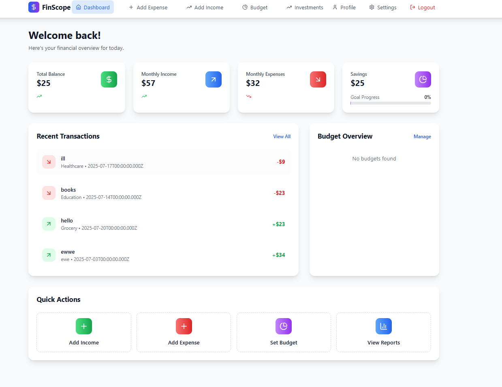
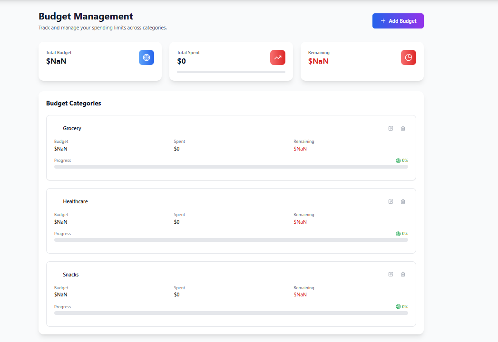

# FinScope - AI-Powered Personal Finance Assistant

FinScope is a full-stack personal finance application for tracking income, expenses, budgets, investments, and financial reports. It includes a smart dashboard, JWT authentication, email alerts, Redis caching, and receipt-scanning capabilities.

## Screenshots

### Landing page


### Dashboard



### Budget management



## Features

- Dashboard with balance, income, expense, savings, and recent transaction summaries
- Income and expense tracking
- Category-based budget management
- Investment and portfolio tracking
- Monthly financial reports and PDF downloads
- JWT-based authentication
- Email notifications and budget alerts
- Receipt scanning and transaction data extraction
- MongoDB persistence and Redis caching

## Tech stack

- **Frontend:** React 19, Vite, Tailwind CSS, Axios
- **Backend:** Node.js, Express, MongoDB, Mongoose
- **Authentication:** JSON Web Tokens (JWT)
- **Cache:** Redis
- **Email:** Nodemailer
- **Infrastructure:** Docker, Docker Compose, Nginx

## Project structure

```text
AiFinancialAssistant/
|-- backend/             # Express API
|   |-- server/
|   |-- .env.example
|   |-- Dockerfile
|   `-- server.js
|-- frontend/            # React/Vite client
|   |-- src/
|   |-- services/
|   `-- Dockerfile
|-- nginx/               # Reverse-proxy configuration
|-- assets/              # README screenshots
|-- docker-compose.yml
`-- readme.md
```

## Prerequisites

Choose one of the following setup methods:

- **Docker setup (recommended):** Docker Desktop with Docker Compose
- **Local setup:** Node.js 20+, npm, MongoDB, and Redis

## Setup with Docker

Docker Compose starts the frontend, backend, MongoDB, Redis, and Nginx.

### 1. Clone the repository

```bash
git clone https://github.com/anshraz27/AiFinancialAssistant.git
cd AiFinancialAssistant
```

### 2. Create the backend environment file

macOS/Linux:

```bash
cp backend/.env.example backend/.env
```

Windows PowerShell:

```powershell
Copy-Item backend/.env.example backend/.env
```

Open `backend/.env` and replace the placeholder values, especially `JWT_SECRET`. You do not need to change `MONGODB_URI` or `REDIS_URL` for Docker; Compose supplies the container addresses automatically.

### 3. Build and start the application

```bash
docker compose up --build
```

Once the containers are healthy, open:

- Frontend: http://localhost:5173
- Nginx entry point: http://localhost
- Backend health check: http://localhost:5000/api/health
- MongoDB: `localhost:27017`
- Redis: `localhost:6379`

Run the stack in the background with:

```bash
docker compose up --build -d
```

### Useful Docker commands

```bash
# View container status
docker compose ps

# Follow logs
docker compose logs -f

# Follow logs for one service
docker compose logs -f backend

# Stop and remove containers
docker compose down

# Stop containers and delete database/node_modules volumes
docker compose down -v
```

> `docker compose down -v` permanently removes the MongoDB data stored in the Docker volume.

The frontend and backend source directories are mounted into their containers, so development changes are reflected without rebuilding in most cases. Rebuild after changing dependencies or Dockerfiles.

## Local setup without Docker

### 1. Clone the repository

```bash
git clone https://github.com/anshraz27/AiFinancialAssistant.git
cd AiFinancialAssistant
```

### 2. Start MongoDB and Redis

Make sure both services are installed and running locally on their default ports:

- MongoDB: `mongodb://localhost:27017`
- Redis: `redis://localhost:6379`

### 3. Configure and run the backend

macOS/Linux:

```bash
cd backend
cp .env.example .env
npm install
npm run dev
```

Windows PowerShell:

```powershell
Set-Location backend
Copy-Item .env.example .env
npm install
npm run dev
```

Edit `backend/.env` before starting the server:

```env
NODE_ENV=development
PORT=5000
MONGODB_URI=mongodb://localhost:27017/finscope
REDIS_URL=redis://localhost:6379
JWT_SECRET=replace_with_a_long_random_secret
FRONTEND_URL=http://localhost:5173
EMAIL_SERVICE=gmail
EMAIL_USER=your_email_here@gmail.com
EMAIL_PASS=your_email_app_password_here
```

The API is available at http://localhost:5000, and its health endpoint is http://localhost:5000/api/health.

### 4. Configure and run the frontend

Open a second terminal from the project root:

```bash
cd frontend
npm install
npm run dev
```

Open http://localhost:5173. Vite proxies `/api` requests to the backend at `http://localhost:5000`.

## Environment variables

| Variable | Required | Description |
| --- | --- | --- |
| `NODE_ENV` | No | Runtime mode; defaults to `development` |
| `PORT` | No | Backend port; defaults to `5000` |
| `MONGODB_URI` | No | MongoDB connection string |
| `REDIS_URL` | No | Redis connection string |
| `JWT_SECRET` | Yes | Secret used to sign and verify authentication tokens |
| `FRONTEND_URL` | No | Frontend URL used by backend integrations |
| `EMAIL_SERVICE` | For email | Nodemailer email provider, such as `gmail` |
| `EMAIL_USER` | For email | Sender email account |
| `EMAIL_PASS` | For email | Email app password or provider credential |

For Gmail, use an app password rather than your normal account password. Never commit `backend/.env` or other real secrets.

## Production build

To verify that the frontend builds successfully:

```bash
cd frontend
npm install
npm run build
```

The production files are generated in `frontend/dist`.

## Troubleshooting

- **Backend is unhealthy:** Check `docker compose logs backend` and confirm `JWT_SECRET` is set.
- **MongoDB or Redis connection fails locally:** Confirm both services are running and that their URLs in `backend/.env` are correct.
- **A port is already in use:** Stop the conflicting service or change the corresponding host port in `docker-compose.yml`.
- **Dependency changes are not detected in Docker:** Run `docker compose up --build`.
- **You want a completely fresh Docker setup:** Run `docker compose down -v`, then `docker compose up --build`.
